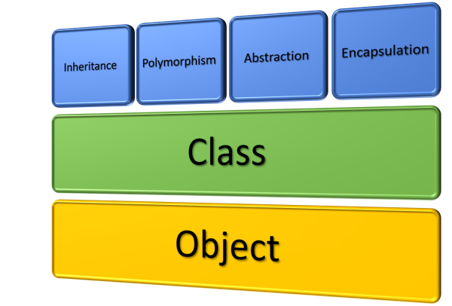

# Intro


## Systèmes « built-in » orientés objet en R

**Fonctionnel (S3 et S4)**

-   Les objets contiennent les données.
-   Les méthodes sont séparées des objets.
-   Les objets ne sont pas « mutables ».

**Encapsulé (Reference Classes)**

-   Les objets contiennent les données et les méthodes
-   Les objets sont « mutables ».
-   Aussi appelé « classical object-oriented programming ».

# Avantages du orienté objet encapsulé

**Abstraction**

-   Cacher les détails d'implémentation qui ne sont pas pertinents
-   Améliore la lisibilité
-   Exemple: automobile

**Héritage**

-   Réutiliser du code d'autres classes (approche DRY).
-   Améliore la lisibilité et la maintenance.

**Encapsulation**

-   Regroupement des données et des méthodes en une seule unité.

**Etc.**



## Débuter avec R6

D'abord, télécharger le package R6 et l'activer

```{r}
#install.packages("R6")
library(R6)
```

On crée une classe avec la fonction `R6Class`. Deux arguments « minimaux »:

-   `classname`: nom de la classe (la bonne pratique est de donner le même nom que le symbole référant à la classe)
-   `public`: liste contenant les attributs et méthodes publics.


**Classe R6 minimale:**

Définir la classe:

```{r}
MaClasseR6 <- 
  R6Class(
    classname = "MaClasseR6",
    public = list()
  )
```

Créer un instance (objet) de classe MaClasseR6 avec la méthode `$new`:

```{r}
objet <- MaClasseR6$new()
```

Inspecter les classes de l'objet créé. Toutes les classes créées héritent de la classe `R6`:

```{r}
class(objet)
```

**Attributs et méthodes**

-   *Attribut*: variable qui appartient à l'objet. Elle représente une propriété ou caractéristique de celui-ci.
-   *Méthode*: fonction qui appartient à l'objet. Permet de modifier celui-ci (ou pas, on peut aussi simplement renvoyer quelque chose)

**Exemple: créer une classe R6 représentant une personne avec 2 attributs (`$name = "Francis"`, `$hair_color = "brun"`) et une méthode (`$greet`)**

```{r}
Person <-
  R6Class(
    classname = "Person", # Nom de la classe
    public = list(
      name = "Francis", # Attributs
      hair_color = "Brun",
      
      greet = function() { # Méthode
        cat(paste0("Hello, my name is ", self$name, " my hair is ", self$hair_color, ".\n"))
      }
    )
  )
```

-   On accède aux attributs et aux méthodes de l'objet avec `self$`.

```{r}
personne <- Person$new()
personne$name
personne$hair_color
personne$greet()
```

-   Pas très versatile de « hardcoder » les attributs. On va plutôt utiliser la méthode spéciale `initialize`. Cette méthode va en fait écraser la méthode `$new`:

```{r}
Person <-
  R6Class(
    classname = "Person",
    public = list(
      name = NULL,
      hair_color = NULL,
      
      initialize = function(name, hair_color) {
        self$name <- name
        self$hair_color <- hair_color
        self$greet()
      },
      
      greet = function() {
        cat(paste0("Hello, my name is ", self$name, ", my hair is ", self$hair_color, ".\n"))
      }
    )
  )
```

-   Lors de l'appel de la méthode `initialize` avec `$new`, les attributs vont se peupler avec les valeurs fournies:

```{r}
personne <- Person$new(name = "Francis", hair = "Brun")
personne
```

Notez que la méthode `$greet` ne modifie pas l'objet. Créer une nouvelle méthode `$set_hair_color` qui va modifier l'attribut `$hair_color`:

```{r}
Person <-
  R6Class(
    classname = "Person",
    public = list(
      name = NULL,
      hair_color = NULL,
      
      initialize = function(name, hair_color) {
        self$name <- name
        self$hair_color <- hair_color
        self$greet()
      },
      
      greet = function() {
        cat(paste0("Hello, my name is ", self$name, ", my hair is ", self$hair_color, ".\n"))
      },
      
      set_hair_color = function(color) {
        self$hair_color = color
      }
    )
  )
```

```{r}
personne <- Person$new(name = "Francis", hair = "Brun")
personne
personne$set_hair_color("bleu")
personne
```

-   Les objets de classe R6 sont donc *mutables* car ils sont modifiables une fois créés.

# Exemple d'application: modèle de prédiction

## Données et packages

```{r, message=FALSE}
library(tidymodels)
library(tidyverse)
library(here)
library(poissonreg)
library(glmnet)
library(glue)

freMTPLfreq <- read_csv(here("data", "freMTPLfreq.csv"))

set.seed(1994)
data_split <- initial_split(freMTPLfreq, prop = 0.7)
data_train <- training(data_split)
data_test <- testing(data_split)
```

## Classe PoissonGLM:

**Définir une classe R6 « PoissonGLM » avec les méthodes suivantes:**

-   `initialize`: prend en arguments:
    -   un vecteur de covariates « features »
    -   un nom de variable réponse « response_name »
    -   un nom de variable d'exposition « expo_name »
-   `fit_model`: prend en argument:
    -   un jeu de données « train_df » et ajuste le GLM
-   `predict`: prend en argument:
    -   un jeu de données « new_df » et renvoie un vecteur de prédictions
-   `print_summary`:
    -   renvoie un résumé du modèle avec les coefficients

```{r}
PoissonGLM <-
  R6Class(
    classname = "PoissonGLM",
    
    public = list(
      
      features = NULL,
      response_name = NULL,
      expo_name = NULL,
      
      formula = NULL,
      fitted_wf = NULL,
      
      initialize = function(features, response_name = "ClaimNb", expo_name = "Exposure") {
        self$features <- features
        self$response_name <- response_name
        self$expo_name <- expo_name
        self$formula <- as.formula(paste(response_name, "~", paste(features, collapse = "+"), "-", expo_name, " + offset(log(", expo_name, "))"))
      },
      
      fit_model = function(train_df) {
        
        # Keep only provided features, response variable and exposure
        response_name_sym <- rlang::sym(self$response_name)
        expo_name_sym <- rlang::sym(self$expo_name)
        
        dat <- 
          train_df |>
          select(
            !!response_name_sym, 
            !!expo_name_sym,
            all_of(self$features)
          )
        
        # Workflow specification
        recette <- 
          recipe( ~ ., data = dat) |>
          update_role(!!response_name_sym, new_role = "outcome")
        
        spec <- poisson_reg(engine = "glm")
        
        wf <-
          workflow() |>
          add_recipe(recette) |>
          add_model(spec, formula = self$formula)
        
        # Fit model and save as an attribute
        fit <- parsnip::fit(wf, data = dat)
        self$fitted_wf <- fit
        
        invisible(self)
      },
      
      predict = function(new_df) {
        predict(self$fitted_wf, new_data = new_df)
      },
      
      print_summary = function() {
        if (is.null(self$fitted_wf)) {stop("You must fit the model before having a summary of it")}
        broom::tidy(self$fitted_wf)
      }
    )
  )
```

-   On peut alors ajuster le modèle, afficher le résumé et prédire sur de nouvelles données:

```{r}
glimpse(data_train)
```

```{r}
model <- PoissonGLM$new(features = c("CarAge", "DriverAge"), response_name = "ClaimNb", expo_name = "Exposure") # Initialiser le nouvel objet
model$fit_model(data_train) # Ajuster sur data_train
model$print_summary()
```

```{r}
model$predict(data_test) # Prédire sur data_test
```

-   On peut aussi enchaîner les méthodes:

```{r}
model <- PoissonGLM$new(features = c("CarAge", "DriverAge"), response_name = "ClaimNb", expo_name = "Exposure") # Initialiser le nouvel objet
model$fit_model(data_train)$predict(data_test)
```

### Méthode `print`

-   La méthode `print` est une méthode spéciale qui permet d'écraser la fonction `print`.
-   Afficher l'objet avec méthode `print` par défaut:

```{r}
model # Même chose que print(model)
```

-   On va se définir une méthode `print` plus élégante:

```{r}
PoissonGLM <-
  R6Class(
    classname = "PoissonGLM",
    
    public = list(
      
      features = NULL,
      response_name = NULL,
      expo_name = NULL,
      
      formula = NULL,
      fitted_wf = NULL,
      
      initialize = function(features, response_name = "ClaimNb", expo_name = "Exposure") {
        self$features <- features
        self$response_name <- response_name
        self$expo_name <- expo_name
        self$formula <- as.formula(paste(response_name, "~", paste(features, collapse = "+"), "-", expo_name, " + offset(log(", expo_name, "))"))
      },
      
      fit_model = function(train_df) {
        
        # Keep only provided features, response variable and exposure
        response_name_sym <- rlang::sym(self$response_name)
        expo_name_sym <- rlang::sym(self$expo_name)
        
        dat <- 
          train_df |>
          select(
            !!response_name_sym, 
            !!expo_name_sym,
            all_of(self$features)
          )
        
        # Workflow specification
        recette <- 
          recipe( ~ ., data = dat) |>
          update_role(!!response_name_sym, new_role = "outcome")
        
        spec <- poisson_reg(engine = "glm")
        
        wf <-
          workflow() |>
          add_recipe(recette) |>
          add_model(spec, formula = self$formula)
        
        # Fit model and save as an attribute
        fit <- parsnip::fit(wf, data = dat)
        self$fitted_wf <- fit
        
        invisible(self)
      },
      
      predict = function(new_df) {
        predict(self$fitted_wf, new_data = new_df)
      },
      
      print_summary = function() {
        if (is.null(self$fitted_wf)) {stop("You must fit the model before having a summary of it")}
        broom::tidy(self$fitted_wf)
      },
      
      print = function() {
        cat("Régression Poisson non-pénalisée \n\n")
        cat("\tVariable réponse: \n\n\t- ", self$response_name, "\n\n", sep = "")
        cat("\tExposition: \n\n\t- ", self$expo_name, "\n\n", sep = "")
        cat("\tPrédicteurs:\n", glue("- {self$features}\n"), sep = "\n\t")
        invisible(self)
      }
    )
  )
```

```{r}
model <- PoissonGLM$new(features = c("CarAge", "DriverAge"), response_name = "ClaimNb", expo_name = "Exposure")
model
```

## Héritage (classe PoissonGLMLasso qui hérite de PoissonGLM)

-   Héritage: mécanisme qui permet, lors de la déclaration d'une nouvelle classe, d'utiliser les attributs et les méthodes d'une autre classe.
-   Avec les classes R6, on définit l'héritage avec l'argument `inherit`.

**Exemple:**

-   Définir une nouvelle classe `PoissonGLMLasso` qui hérite de la classe `PoissonGLM`. Écraser la méthode `fit_model`, qui doit maintenant avoir un argument `lambda`. Les méthodes `initialize`, `predict` et `print_summary` sont héritées.

-   On commence avec:

```{r}
PoissonGLMLasso <-
  R6Class(
    classname = "PoissonGLMLasso",
    inherit = PoissonGLM, # Classe « parent »
    
    public = list()
  )
```

-   Cette classe `PoissonGLMLasso` hérite de la classe `PoissonGLM`, donc on peut l'utiliser de la même manière.
-   Toute méthode définie dans la classe « enfant » `PoissonGLMLasso` et qui a le même nom qu'une méthode définie dans la classe parent va écraser celle-ci.
-   On va donc écraser la méthode `fit_model` puisque la manière d'ajuster un GLM et un GLM Lasso diffère. On voudrait peut-être aussi écraser la méthode `print`.

```{r}
PoissonGLMLasso <-
  R6Class(
    classname = "PoissonGLMLasso",
    inherit = PoissonGLM,
    
    public = list(
      fit_model = function(train_df, lambda) {
        
        # Keep only provided features, response variable and exposure
        response_name_sym <- rlang::sym(self$response_name)
        expo_name_sym <- rlang::sym(self$expo_name)
        
        dat <- 
          train_df |>
          select(
            !!response_name_sym, 
            !!expo_name_sym,
            all_of(self$features)
          )
        
        # Workflow specification
        recette <- 
          recipe( ~ ., data = dat) |>
          update_role(!!response_name_sym, new_role = "outcome") |>
          step_normalize(all_numeric_predictors(), -!!expo_name_sym)
        
        spec <- poisson_reg(engine = "glmnet", penalty = lambda, mixture = 1)
        
        wf <-
          workflow() |>
          add_recipe(recette) |>
          add_model(spec, formula = self$formula)
        
        # Fit model and save as an attribute
        fit <- parsnip::fit(wf, data = dat)
        self$fitted_wf <- fit
        
        invisible(self)
      }
    )
  )
```

```{r}
model <- PoissonGLMLasso$new(features = c("CarAge", "DriverAge"), response_name = "ClaimNb", expo_name = "Exposure")
class(model)
```

```{r}
model$fit_model(data_train, lambda = 0.001)
model$print_summary()
```


-   Notez que l'héritage aide à ne pas dupliquer le code et aide donc pour la lisibilité et la maintenance.
-   Idée pour la classe `PoissonGLMLasso`: ajouter une méthode `$tune_lambda` qui va nous trouver la meilleure valeur de lambda en utilisant de la validation-croisée.

## Classe `Metrics`

**Exemple:** 

- Définir une classe `Metrics` qui prend en entrée un objet de classe `PoissonGLM` et un jeu de données de validation dans sa méthode `initialize`. 
- Implémenter la méthode `$compute_rmse()` et `$plot_lorenz_curve()`.

```{r}
Metrics <- 
  R6Class(
    classname = "Metrics",
    
    public = list(
      
      PoissonGLM_model = NULL,
      valid_df = NULL,
      
      initialize = function(PoissonGLM_model, valid_df) {
        self$PoissonGLM_model <- PoissonGLM_model
        self$valid_df <- valid_df
        if (is.null(PoissonGLM_model$fitted_wf)) {stop("You must fit the model before using the Metrics class")}
      },
      
      compute_rmse = function() {
        pred_vec <- pull(self$PoissonGLM_model$predict(self$valid_df))
        target_vec <- self$valid_df[[self$PoissonGLM_model$response_name]]
        
        sqrt(mean((pred_vec - target_vec) ^ 2))
      },
      
      plot_lorenz_curve = function() {
        df_lorenz <- 
          self$valid_df |>
          add_column(self$PoissonGLM_model$predict(self$valid_df)) |>
          mutate(.pred = .pred / Exposure) |>
          select(ClaimNb, Exposure, .pred) |>
          arrange(.pred) |>
          mutate(
            cum_expo = cumsum(Exposure) / sum(Exposure),
            cum_ClaimNb = cumsum(ClaimNb) / sum(ClaimNb)
          )
        
        df_lorenz |>
          ggplot(aes(x= cum_expo, y = cum_ClaimNb)) + 
          geom_abline(slope = 1, linetype = "dashed", color = "black") +
          geom_line(alpha = 0.7)   + 
          scale_y_continuous(labels = scales::percent_format()) +
          scale_x_continuous(labels = scales::percent_format()) +
          labs(
            title = "Lorenz Curve",
            x = "Cumulative earned exposure (% of total)",
            y = "Cumulative number of claims (% of total)",
          ) +
          theme_bw()
      }
    )
  )
```

```{r}
model <- PoissonGLM$new(features = c("CarAge", "DriverAge"), response_name = "ClaimNb", expo_name = "Exposure")
model$fit_model(data_train)
metrics <- Metrics$new(model, data_test)
metrics$compute_rmse()
metrics$plot_lorenz_curve()
```

- Idée: ajouter des méthodes pour plusieurs autres métriques et définir une nouvelle méthode `print_metrics` qui va nous afficher toutes les métriques